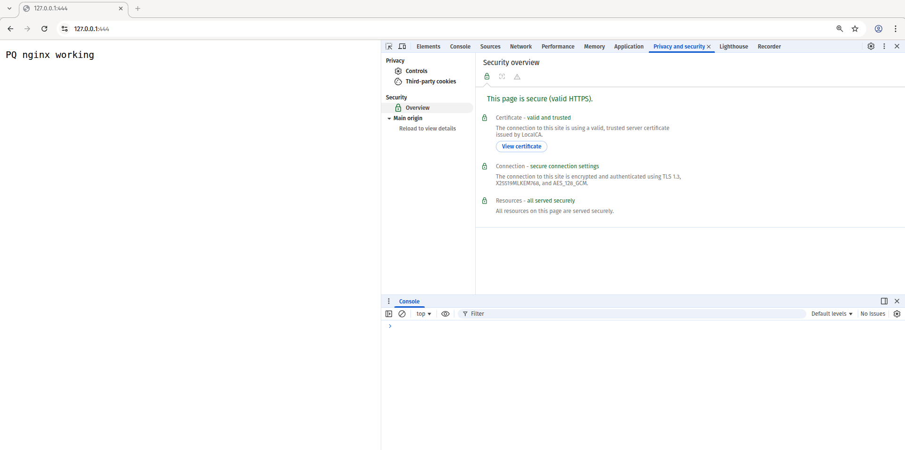

## Post-Quantum NGINX Demonstration
> Information regarding the current state of post-quantum cryptography in this repository was last updated on 13 February 2026. 

This repository provides a minimal, reproducible demonstration of a quantum-safe HTTPS web server (or reverse proxy) using NGINX and OpenSSL.

Key aspects:
- `X25519MLKEM768` hybrid TLS key exchange;
- `ML-DSA` or `RSA` certificate signature algorithm;
- OpenSSL v3.5.0 linked with NGINX v1.26.2;
- Docker environment;
- Self-contained certificate generation scripts.

## Introduction

Introducing post-quantum cryptography into HTTPS requires updating two key aspects of TLS security:
- Signature algorithms;
- Key exchange algorithms.

### Post-Quantum Signatures

Adopting a post-quantum digital signature algorithm requires updating the certificate chain. Currently, two standard PQ-DSAs are available:
- ML-DSA (FIPS 204);
- SLH-DSA (FIPS 205).

### Post-Quantum Key Exchanges

Switching to a post-quantum key exchange does not require changes to certificates or server keys, because TLS handshakes use ephemeral keys. However, both the HTTPS client and server must support and negotiate its use.

The recommended approach, at the time of writing this text, is to use a hybrid key exchange, combining classical and post-quantum algorithms. This approach:
- Ensures backwards compatibility with older clients;
- Enhances security-in-depth, since the final session key depends on both classical and post-quantum contributions.

Currently, there is one standard PQ-KE named ML-KEM. 

## How to run

First, build the Docker container:
```bash
docker build --build-arg USE_MLDSA=false -t quantum-safe-web-server .
```

To use ML-DSA set `USE_MLDSA=true` in the previous command, RSA is used by default.

Next, run it:
```bash
docker run --rm -p 444:443 quantum-safe-web-server
```

The server will be exposed on the host on `127.0.0.1:444`.

---

If you are in a Bash-compatible environment, both of those command can be ran simply by:
```bash
bash scripts/build.sh false # use true for ML-DSA
bash scripts/run.sh
```

## Access the certificates and keys

To access the certificates and keys being used by nginx, first get the ID of the container and then run:
```
docker cp <container_id>:/opt/nginx/conf/certs/ certs/
```

This might come handy to further analyze the certificates and keys and/or to remove the browser warnings by adding the CA certificate to the list of trusted CAs.

## Test

To test, just open your browser of preference and access `https://127.0.0.1:444/`. 

To verify the usage of the selected algorithms, check for the SSL/TLS security parameters that are usually displayed by accessing the developer's tools of the browser.



If the browser is not able to finish the handshake, it will display an error message such as "active content with certificate errors". If that is the case, check if your browser version supports the algorithms being used. At the time of writing this, most browsers do not support ML-DSA, but ML-KEM is mostly supported. 

## References

- [ML-KEM (FIPS 203)](https://csrc.nist.gov/pubs/fips/203/final)
- [ML-DSA(FIPS 204)](https://csrc.nist.gov/pubs/fips/204/final)
- [SLH-DSA(FIPS 205)](https://csrc.nist.gov/pubs/fips/205/final)
- [Post-quantum hybrid ECDHE-MLKEM Key Agreement for TLSv1.3](https://datatracker.ietf.org/doc/draft-kwiatkowski-tls-ecdhe-mlkem/)
- [Post-Quantum Cryptography support in NGINX](https://blog.nginx.org/blog/pqc-nginx)